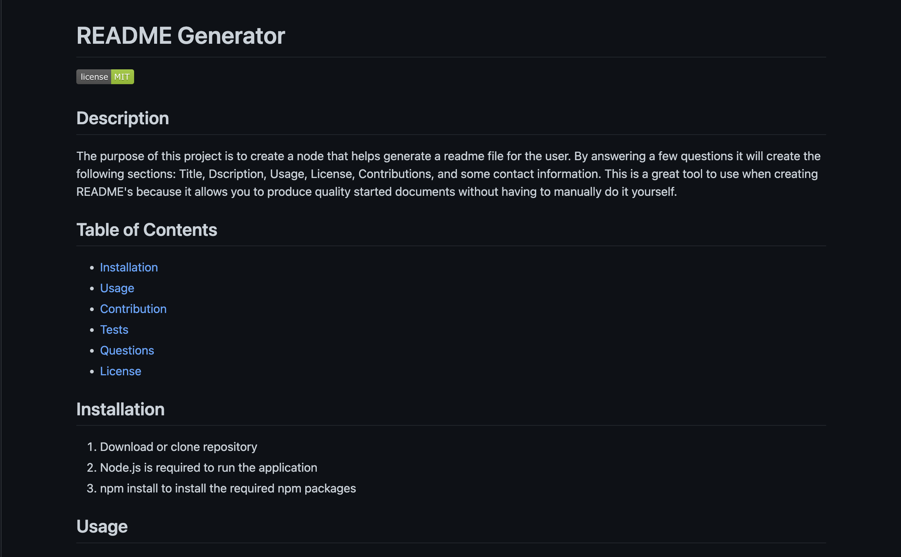

   # README Generator

   
    
   ## Description
    
  The purpose of this project is to create a node that helps generate a readme file for the user. By answering a few questions it will create the following sections: Title, Dscription, Usage, License, Contributions, and some contact information. This is a great tool to use when creating README's because it allows you to produce quality started documents without having to manually do it yourself.

  ## Table of Contents
   * [Installation](#installation)
   * [Usage](#usage)
   * [Contribution](#contribution)
   * [Tests](#tests)
   * [Questions](#questions)
   * [License](#license)
    
  ## Installation
1. Download or clone repository
2. Node.js is required to run the application
3. npm install to install the required npm packages

  ## Usage
The usage of this project is to have an easy setup for a README.md file. Below is an image example. You can download a video of how it runs 

  ## Tests
   To test this node simply rund the node index.js command and the 10 prompts should initiate. Bugs to be aware of are if you alter any const names it will break the code.

  ## Contribution
   Huge thank you to office hours, classmates and google for helping complete this project.

  ## Questions
   * Checkout my [GitHub profile](https://github.com/jgporter24)
    
   * Any additional questions or feed back, feel free to [send an email](mailto:jess.g.porter@gmail.com). 
    
  ## License
   Copyright (c) [jgporter24](https://github.com/jgporter24). All rights reserved.
    
   Licensed under the MIT license.
    
  
